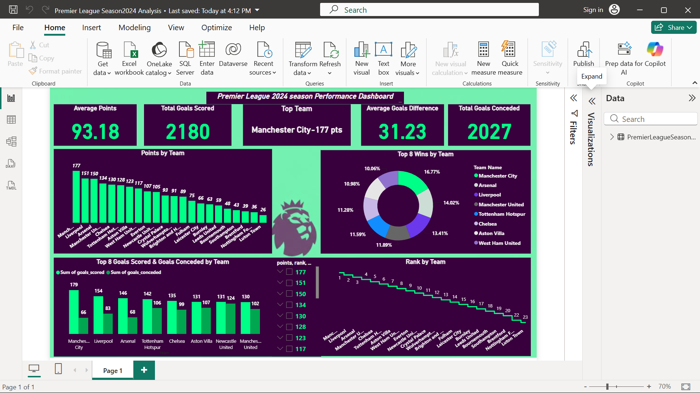

# Premier League 2024 Season Performance Analysis

A Power BI dashboard analyzing team performance across the Premier League 2024 season — points, wins, goals scored/conceded, and league rank.

## Goal
Visualize and compare team performance across the season to identify top performers and standout stats.

## Tools
Power BI (Desktop)

## File
`Premier_League_Season2024_Analysis.pbix` — includes the data model, report page, and visuals. Open directly in Power BI Desktop (free) to explore interactively.

## What's in the dashboard
KPI cards (Top Team, Total Goals Scored, Total Goals Conceded, Average Goals Difference, Average Points) plus:
- Points by Team
- Top 8 Wins by Team
- Top 8 Goals Scored & Goals Conceded by Team
- Rank by Team (over the season)

## Preview

